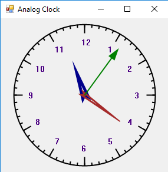

# МИПиС

## Task 09. Разработка аналоговых часов

Срок выполнения работы: **до 24 мая**


**Цель работы:** научиться создавать приложения Windows Forms с использованием элементов графики, изучить событие **Paint**.

## Часы

В данной работе нужно написать реализацию стрелочных часов.



## Выполнение работы

Объявление пакетов:

```
using System.Drawing;
using System.Drawing.Drawing2D;
```


Главный код программы сосредоточен в функции-обработчике события

```
 private void Form_Paint(object sender, PaintEventArgs e)
```

Алгоритм работы обработчика можно описать следующим образом:

- Получение доступа к текущему времени 
  ```DateTime dt = DateTime.Now;```
- Создание перьев и кистей для рисования
  ```
   Pen cir_pen = new Pen(Color.Black,2);
   Brush brush = new SolidBrush(Color.Indigo); 
  ```
- Получение графического контекста 
  ```
   Graphics g = e.Graphics;
  ```
- Объявление объекта для сохранения текущего состояния
  ```
   GraphicsState gs;
  ```
  
- Масштабирование рисунка и перенесение начала координат в центр
  ```
  g.TranslateTransform(w / 2, h / 2);
  g.ScaleTransform(w / 200, h / 200);
  ```
- Рисование циферблата
  ```
  g.DrawEllipse(cir_pen, -120, -120, 240, 240);
  ```
- Рисование стрелок

  Стрелки рисуются в виде прямых линий или соединенных несколько точек линиями (Polygon). Положение линий определяется текущим временем, которое нужно перевести в градусы поворота относительно начала координат на окружности (вертикальная линия).
  ```
  gs = g.Save();
  g.RotateTransform(6 * (dt.Minute + (float)dt.Second / 60));
  g.DrawLine(new Pen(new SolidBrush(Color.Brown), 4), 0, 0, 0, -80);
  g.Restore(gs);
  ```
  Сначала сохраняется текущее состояние, потов выполняется поворот на заданное количество градусов и рисуется линия. Потом восстанавливается текущее состояние графического контекста. 
  
  - Для активизации процедуры рисования надо создать элемент управления **Timer** и назначить обработчик события **Tick** (с частотой 1 раз в секунду)
  
  ```
   private void timer1_Tick(object sender, EventArgs e)
   {
       this.Invalidate();
   }
   ```
   вызов **Invalidate()** приводит к необходимости перерисовки формы, для чего вызывается обработчик **Paint**

## Результаты работы

Результаты работы в виде файлов проекта (кроме исполняемых, находящихся в папке `Debug` или `Release`) прислать в пул-запросе (в папке `App`) для своей ветки. Сделать скриншот главного окна приложения Windows Forms и поместить файл в корень репозитория.

### Список участников/веток

см. репозиторий `mod-branches`